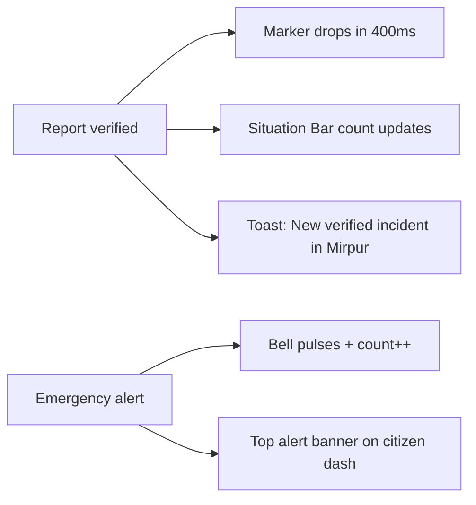

# Frontend Build & Design Plan — Disaster Monitoring Platform

**Companion to:** `Disaster_Platform_Project_Plan.md` (the backend/DB source of truth)
**Stack it targets:** Inertia.js + Vue 3 (Composition API) + Vite + Tailwind CSS
**Team:** Nurnahar Nuri (210147) · Riazul Islam Mubin (210161) — DIIT, CSE

This document is the **design source of truth**. The main plan tells you what to build on the server; this tells you exactly what every screen looks like, the tokens to paste, the components to build, and the order to build them in. Nothing here is "decoration added later" — it's a system you wire in from day one of frontend work.

---

## 0. The Design Direction (decide this once, never re-debate)

> **Direction name: "Situation Room / Calm Authority."**

A disaster platform has one emotional job: feel **trustworthy and calm** while making **severity impossible to misread**. People arrive stressed. Admins work fast under pressure. So:

- **Public + citizen side = light, reassuring, spacious.** Looks like a credible civic service, not a startup landing page.
- **Operational side (admin review, live map, responder) = dark "control-room" surface.** Dense, instrument-like, focused.
- **Color shouts in exactly one place: the severity scale.** Everything else stays quiet (slate + one trusted brand teal). This is the whole trick — when most of the UI is calm, a critical-red marker actually reads as critical.

**The grounded details that make it *this* project and not a generic dashboard:**
1. **Bilingual type system** (Bangla + English) — your DB already carries `name_bn`, so the UI must render Bangla properly with a real Bangla face, not a fallback.
2. **Instrument readouts** — coordinates, report IDs, timestamps, and the live clock render in a monospace "data" face. It ties every screen to the monitoring theme.
3. **The radar pulse** — verified *critical* incidents get one calm pulsing ring on the map. That is the single signature animation. It is not used anywhere else.

**Signature element:** a thin **Situation Bar** pinned to the top of operational screens showing live counts (`● 3 critical · ▲ 7 high · 12 pending`) in the data face, with a ticking clock. It's the one piece people remember, and it's used in one place only.

---

## 1. Design Tokens

Paste these into `tailwind.config.js`. Every color/spacing decision in the app derives from here — no raw hex in components.

### 1.1 Color

```js
// tailwind.config.js
import defaultTheme from 'tailwindcss/defaultTheme'

export default {
  content: ['./resources/**/*.{vue,js,blade.php}'],
  darkMode: 'class',
  theme: {
    extend: {
      colors: {
        // Structural "storm slate" — operational surfaces (never pure black)
        ink: {
          900: '#0B1220', // deepest: control-room bg, dark map
          800: '#131C2E',
          700: '#1C2840',
          600: '#2A3A57',
          500: '#3D5277', // borders on dark
        },
        // Light surfaces — public + citizen side
        paper:   '#F7F8FB', // cool off-white app bg
        surface: '#FFFFFF',
        line:    '#E4E8F0', // hairline borders (light)

        // Brand "Bay" teal (Bay of Bengal — water, trust, calm)
        bay: {
          50:  '#E6F6F7',
          400: '#2BB7C2',
          500: '#109AA6',
          600: '#0E7C86', // PRIMARY action color
          700: '#0B626B',
        },

        // SEVERITY SCALE — the one place color is allowed to be loud.
        // Colorblind-safe: each level also carries a distinct icon + label.
        sev: {
          low:      '#2E9E6B', // calm green   — dot ●
          medium:   '#E0A100', // amber        — hollow triangle △
          high:     '#E5611F', // orange       — filled triangle ▲
          critical: '#D62839', // red          — diamond ◆ (pulses)
        },

        // STATUS (report lifecycle — separate from severity, quieter)
        status: {
          pending:  '#B7791F',
          verified: '#157F6B',
          rejected: '#B03A4A',
        },
      },
      fontFamily: {
        display: ['Archivo', ...defaultTheme.fontFamily.sans],        // headings, wordmark
        sans:    ['Inter', ...defaultTheme.fontFamily.sans],           // body / UI (Latin)
        bangla:  ['"Hind Siliguri"', ...defaultTheme.fontFamily.sans], // name_bn, BN content
        data:    ['"JetBrains Mono"', ...defaultTheme.fontFamily.mono], // coords, IDs, clock
      },
      borderRadius: {
        sm: '4px', DEFAULT: '8px', md: '8px', lg: '12px', xl: '16px',
      },
      boxShadow: {
        // soft, low, layered — never a hard generic drop shadow
        card:  '0 1px 2px rgba(13,22,38,.04), 0 4px 12px rgba(13,22,38,.06)',
        lift:  '0 8px 28px rgba(13,22,38,.12)',
        focus: '0 0 0 3px rgba(16,154,166,.35)', // bay focus ring
      },
    },
  },
  plugins: [require('@tailwindcss/forms')],
}
```

> **Rule:** Severity colors (`sev.*`) appear ONLY on severity badges, map markers, and the Situation Bar. Status colors (`status.*`) appear ONLY on lifecycle badges. If you reach for `sev.critical` to style a button, stop — you're diluting the one signal that has to stay sharp.

### 1.2 Typography

All four faces are free and self-hostable (`@fontsource/*` or Google Fonts). **Self-host them** so the app works on weak/rural connections without a Google round-trip.

| Role | Face | Where it's used | Weights |
|---|---|---|---|
| **Display** | Archivo | Headings, wordmark, section labels — institutional/signage feel | 600, 700 |
| **Body / UI** | Inter | Paragraphs, labels, buttons (Latin) | 400, 500, 600 |
| **Bangla** | Hind Siliguri | Any `name_bn`, Bangla article body, bilingual labels | 400, 500, 600 |
| **Data** | JetBrains Mono | Coordinates, report IDs (`#RPT-0481`), timestamps, the live clock | 400, 500 |

**Type scale** (clamp-based, mobile-safe):

```css
--text-xs:  0.75rem;   /* captions, meta */
--text-sm:  0.875rem;  /* secondary UI */
--text-base:1rem;      /* body */
--text-lg:  1.125rem;
--text-xl:  clamp(1.25rem, 1.1rem + .6vw, 1.5rem);   /* card titles */
--text-2xl: clamp(1.6rem, 1.3rem + 1.2vw, 2.25rem);  /* page titles */
--text-3xl: clamp(2rem, 1.5rem + 2.4vw, 3.25rem);    /* hero */
```

Headings: `font-display`, tracking-tight (`-0.01em`), weight 700. Body: `font-sans`, line-height 1.6. **Bilingual rule:** wrap Bangla strings in a `.bn` utility (`font-bangla`) so they never render in Inter (which has no Bengali glyphs). A `<BiText :en :bn />` helper that picks the locale is cleaner than scattering classes.

### 1.3 Spacing, grid, motion

- **Spacing:** 4px base scale (Tailwind default). Public content max-width `max-w-6xl`; control-room is full-bleed with a 240px sidebar.
- **Grid:** 12-col on desktop, single-col stacked on mobile. Cards snap to a consistent 16/24px gutter.
- **Motion:** durations 150ms (hover), 250ms (enter), 400ms (map marker drop). Easing `cubic-bezier(.2,.7,.2,1)`. **All motion must respect `prefers-reduced-motion`** — the radar pulse becomes a static ring.

### 1.4 Tailwind Class Quick Reference

Standardize these across every file — no one-offs.

| Element | Classes |
|---|---|
| Page background | `bg-slate-50` |
| Card | `bg-white rounded-xl shadow-sm ring-1 ring-gray-200` |
| Card hover | `hover:shadow-md hover:ring-bay-400 transition-all` |
| Section heading | `text-xl font-semibold font-display text-gray-900` |
| Sub-heading / meta | `text-sm font-medium text-gray-500` |
| Primary button | `bg-bay-600 hover:bg-bay-700 text-white px-4 py-2 rounded-lg font-medium` |
| Danger button | `bg-red-600 hover:bg-red-700 text-white px-4 py-2 rounded-lg font-medium` |
| Ghost button | `border border-gray-300 hover:bg-gray-50 text-gray-700 px-4 py-2 rounded-lg` |
| Table header | `bg-gray-50 text-xs font-semibold text-gray-500 uppercase tracking-wider` |
| Table row | `border-b border-gray-100 hover:bg-gray-50` |
| Data/mono value | `font-data text-sm text-ink-600` |
| Focus ring | `focus:outline-none focus:ring-[3px] focus:ring-bay-400/35` |

---

## 2. The Severity & Status System (the heart of the UI)

This is what a disaster platform lives or dies on. Get it consistent everywhere.

### 2.1 Severity — never color alone

```
LOW       ● sev.low       "Low"        green dot
MEDIUM    △ sev.medium    "Medium"     hollow amber triangle
HIGH      ▲ sev.high      "High"       filled orange triangle
CRITICAL  ◆ sev.critical  "Critical"   red diamond + pulse ring (map only)
```

`<SeverityBadge :level="report.severity" />` renders **icon + label + color** together, always. In grayscale or for colorblind users, the icon and word still carry the meaning. The badge is a tinted chip: `bg` at 10% opacity of the sev color, text/icon at full.

### 2.2 Status — quieter, lifecycle only

```
PENDING   ◷ status.pending   "Awaiting review"
VERIFIED  ✓ status.verified  "Verified"
REJECTED  ✕ status.rejected  "Not verified" (muted, with reason on hover/expand)
```

> Copy note: public-facing, say **"Verified"** not "Approved" — the citizen sees their report was confirmed, not granted a favor. Use "Awaiting review," not "Pending" (system word).

### 2.3 Category markers (map)

Map markers combine **category color** (the fill, from `categories.color`) with a **severity ring** (the outline). One look encodes both facts at a glance. Recommended category palette to seed:

```
Flood #2563C9 · Fire #E5481F · Cyclone #7A5CD0
Road Accident #B45309 · Building Collapse #6B7280 · Other #0E7C86
```

---

## 3. App Shells (one per audience)

Three distinct shells, shared component library underneath.

### 3.1 Public / Citizen shell — light

```
┌──────────────────────────────────────────────────────────┐
│  ◷ DisasterWatch BD        Map   News   [ Report ]  Sign in│  ← sticky, surface bg, hairline bottom
├──────────────────────────────────────────────────────────┤
│                                                            │
│                    page content (max-w-6xl)                │
│                                                            │
├──────────────────────────────────────────────────────────┤
│  Footer: emergency hotlines · about · districts            │
└──────────────────────────────────────────────────────────┘
```

### 3.2 Control-room shell — dark (Admin + Responder)

The admin sidebar is a fixed **240px dark navy panel** on the left, with the Situation Bar spanning full width above it.

```
┌──────────────── SITUATION BAR (ink-900) ──────────── 14:32:07 ┐
│  ● 3 critical   ▲ 7 high   ◷ 12 pending        ⟳ live  🔔 2   │  ← data font
├──────────────┬─────────────────────────────────────────────────┤
│ SIDEBAR      │                                                  │
│ 240px        │   workspace (ink-900, cards = ink-800)           │
│ bg-[#0f172a] │                                                  │
│              │                                                  │
│ [🔴 Safenix] │                                   [bell] [avatar]│
│ ──────────── │                                                  │
│ ▸ Dashboard  │                                                  │
│ ▸ Reports  ⑫ │   ← yellow badge = pending count                │
│ ▸ Map        │                                                  │
│ ▸ Teams      │                                                  │
│ ▸ Alerts     │                                                  │
│ ▸ News       │                                                  │
│              │                                                  │
│ ──────────── │                                                  │
│ [Profile]    │                                                  │
│ [Logout]     │                                                  │
└──────────────┴─────────────────────────────────────────────────┘
```

Sidebar design details:
- Background: `bg-[#0f172a]` (ink-900)
- Active link: white text + 3px left bay-colored border + `bg-white/10` highlight
- Pending Reports nav item: yellow count badge (passed via Inertia shared props)
- Collapses to icon-only rail at < 1024px

### 3.3 Citizen dashboard shell — light, simpler

Top bar + a slim left rail (Dashboard / New report / My reports / Notifications). Friendly, low-density — this user reports once and checks status, they are not power users.

---

## 4. Page-by-Page Specs

Only the screens that need a designed layout. Each gets a wireframe + the must-have details.

### 4.1 Public Home (`/`)

The hero is a **thesis, not a banner**. The most characteristic thing in this product's world is *the live situation right now* — so the hero IS a small live map with the Situation Bar above it. No stock photo of a flood.

```
┌──────────────────────────────────────────────────────────┐
│  ● 2 active critical incidents in Bangladesh · updated live│  ← live ticker (data font)
│                                                            │
│  Report what's happening.            ┌──────────────────┐ │
│  Help your district respond.         │                  │ │
│                                      │   LIVE MINI-MAP  │ │
│  [ Report an incident ]  [ View map ]│   (clustered)    │ │
│                                      │                  │ │
│                                      └──────────────────┘ │
├─────────── STATS BAR (bg-gray-900, white text) ────────────┤
│  [ 📋 2,340 Reports ]  [ ✅ 1,890 Verified ]  [ 🗺️ Live Map ]  [ 📰 News ]
├──────────────────────────────────────────────────────────┤
│  How it works:  ① Submit → ② Admin verifies → ③ Appears on map │
│  Latest verified  →  [card] [card] [card]                 │
│  Recent news      →  [article] [article]                  │
└──────────────────────────────────────────────────────────┘
```

Copy: lead with the action the visitor controls ("Report what's happening"), not a slogan. Verified-only data here — pending/rejected never leak to public.

### 4.2 Live Incident Map (`/map`) — the showpiece

Dark control-room surface even for public (this is where "Situation Room" earns its name).

```
┌── Situation Bar (counts + clock) ────────────────────────┐
├───────────────┬──────────────────────────────────────────┤
│ FILTERS       │                                          │
│ District ▾    │            GOOGLE MAP (dark style)        │
│ Category ▾    │        clustered colored markers          │
│ Severity ▾    │        ◆ critical pulses gently           │
│ ── ── ── ──   │                                          │
│ LEGEND        │   ┌─ incident peek card (on marker tap) ─┐│
│ ● low ▲ high  │   │ #RPT-0481 · Flood · ▲ High           ││
│ ◆ critical    │   │ Mirpur, Dhaka · 2h ago               ││
│               │   │ [ photo ] [ View full ]              ││
│               │   └──────────────────────────────────────┘│
└───────────────┴──────────────────────────────────────────┘
```

On mobile: filters move to a bottom sheet; clicking a marker slides a detail panel in from the right (not a browser popup).

- **Custom dark Google Maps style** (muted ink water/land, no POI noise) so the colored markers pop. Provide a `mapStyle.json`.
- **Marker clustering** (`@googlemaps/markerclusterer`) so dense districts stay readable.
- **Live:** new verified markers **drop in** (400ms ease) via the `incidents` Reverb channel — no refresh. A subtle toast: "New verified incident in {district}."
- Filters update the map without a full reload (Inertia partial / client filter on loaded GeoJSON).
- **Incident count badge** in header: "Showing 34 verified incidents."

### 4.3 Report Submission (`/reports/create`) — the highest-stakes flow

A stressed person must finish this in under a minute. The form is organized as **three named steps** with a `<StepIndicator>` progress track at the top. On desktop the active step is two-column (form left, contextual panel right); on mobile it is single-column stacked with a sticky bottom button.

```
Step ① ─── Step ② ─── Step ③          ← StepIndicator.vue
```

**Step 1 — What happened?**

```
┌── What happened? ─────────────────────────────────────────┐
│                                                           │
│  Category  (icon grid — tap a card, selected = bay ring)  │
│  ┌──────────┐ ┌──────────┐ ┌──────────┐                  │
│  │ 🌊 Flood │ │ 🔥 Fire  │ │ 🌀 Cyclone│                 │
│  └──────────┘ └──────────┘ └──────────┘                  │
│  ┌──────────┐ ┌──────────┐ ┌──────────┐                  │
│  │🏚️Collapse│ │🚗Accident│ │ ❓ Other │                  │
│  └──────────┘ └──────────┘ └──────────┘                  │
│                                                           │
│  Severity   [ ● Low   △ Medium   ▲ High   ◆ Critical ]    │
│             (segmented control — all options visible)     │
│                                                           │
│  Title      [_________________________________________]   │
│  Details    [                                         ]   │
│                                                           │
│                               [ Next: Where → ]          │
└───────────────────────────────────────────────────────────┘
```

- Category selector is a **6-card icon grid** (Flood / Fire / Cyclone / Building Collapse / Road Accident / Other). Selected card gets a `ring-2 ring-bay-600` highlight. This replaces a plain dropdown — the visual grid is faster to scan for a stressed user.
- **Severity is a segmented control**, not a dropdown — the user *sees* all four options with their icons and picks decisively.

**Step 2 — Where?**

```
┌── Where did this happen? ─────────────────────────────────┐
│  [ ⊕ Use my location ]  ← primary path (geolocation)     │
│                                                           │
│  ┌──── MAP PICKER (full width this step) ───────────────┐ │
│  │          drop pin to mark exact location             │ │
│  └──────────────────────────────────────────────────────┘ │
│  lat 23.8103  lng 90.4125   ← data font readout           │
│                                                           │
│  District  [ ▾ ]   Upazila  [ ▾ ]   (cascading)          │
│                                                           │
│  [ ← Back ]                      [ Next: Evidence → ]    │
└───────────────────────────────────────────────────────────┘
```

- **"Use my location"** is the primary path (geolocation → drops the pin → reverse-geocodes district). Manual pin-drop is the fallback.
- **Live coordinate readout** under the map in the data font — confirms to the user exactly what is being sent.
- Cascading District → Upazila dropdowns (from seeded tables).

**Step 3 — Evidence**

```
┌── Add evidence ───────────────────────────────────────────┐
│  [  drag & drop photos / one short video  ]               │
│  [thumb] [thumb] [+]                                      │
│                                                           │
│  [ ← Back ]                          [ Submit report ]   │
│                                      ← sticky on mobile   │
└───────────────────────────────────────────────────────────┘
```

After submit: **not** a dead "success" page. Redirect to "My Reports" with the new card showing `◷ Awaiting review` and a one-line note: "An admin will verify this shortly. You'll be notified."

### 4.4 My Reports (`/my-reports`)

Cards on mobile, table on desktop. Each card/row shows `<SeverityBadge>` + `<StatusBadge>` + thumbnail + timestamp (data font).

- **Status timeline** per report: `Submitted → Under Review → [Verified / Rejected]`
- Rejected entries show the **rejection reason inline** (not hidden in a tooltip) — respecting the user's effort. Render in a red info box.
- Filter tabs: All | Pending | Verified | Rejected.

### 4.5 Admin Dashboard (`/admin/dashboard`)

**Stat cards** — 6 cards in a 3-col grid, each with:
- Heroicon in a colored circle background
- Metric value in the data font (large, prominent)
- Trend indicator: `↑ 4 today` in small green/red text below

```
┌─────────────┐  ┌─────────────┐  ┌─────────────┐
│ ⚠ Pending   │  │ ✓ Verified  │  │ ✕ Rejected  │
│    12        │  │    89        │  │    3         │
│ ↑ 4 today   │  │ ↑ 7 today   │  │              │
└─────────────┘  └─────────────┘  └─────────────┘
┌─────────────┐  ┌─────────────┐  ┌─────────────┐
│ 👥 Users    │  │ 🚑 Teams    │  │ 📰 News     │
│    248       │  │    8         │  │    34        │
└─────────────┘  └─────────────┘  └─────────────┘
```

**Recent Activity Feed** (below stats) — pass `recent_reports` (last 5) from controller:

```
● [CRITICAL] Flood in Sylhet — 2 mins ago       [Review →]
● [HIGH]     Building collapse, Dhaka — 14 mins  [Review →]
● [MEDIUM]   Road accident, Chittagong — 1hr     [Review →]
```

**Quick Actions** — icon pill-buttons, not plain text links:

```
[🔍 Review Reports]  [🚨 Send Alert]  [📝 Write Article]  [👥 Manage Teams]
```

### 4.6 Admin Review Queue (`/admin/reports`) — where admins live

Control-room. Split view: **list left, full review pane right.** Keyboard-driven (`J/K` to move, `A` approve, `R` reject) so an admin can clear a queue fast.

Filter tabs at top: `All | Pending (12) | Verified | Rejected`

```
┌── Pending review · 12 ────────────────────────────────────┐
│ QUEUE          │  REVIEW PANE                              │
│ ▸ #0481 ▲ 2h   │  #RPT-0481   ▲ High   ◷ Awaiting review   │
│   #0480 ◆ 3h   │  ┌─────────┐  Flood — "Water rising fast" │
│   #0479 ● 4h   │  │ MEDIA   │  reporter: Karim · 2h ago    │
│                │  │ gallery │  ┌── mini-map w/ exact pin ─┐ │
│                │  └─────────┘  │ 23.8103, 90.4125         │ │
│                │  Full description text…                   │
│                │                                           │
│                │  [ ✓ Verify ]   [ ✕ Reject (reason…) ]    │
└────────────────┴───────────────────────────────────────────┘
```

- Reject opens an inline reason field — **required**, with quick-pick chips ("Duplicate," "Insufficient evidence," "Out of scope") + free text.
- Media gallery: horizontal scroll thumbnails, click to expand in modal lightbox.
- On verify: optimistic UI (card leaves the queue instantly), Situation Bar pending-count ticks down live, and the marker broadcasts to the public map.
- New pending reports arrive live on the `admin-reports` channel — the queue header badge increments with a soft pulse.

### 4.7 Rescue Team Assignment (`/admin/reports/{id}/assign`)

Modal or right-drawer over the incident:

```
┌── Assign rescue team · #RPT-0481 ─────────┐
│  Team   [ Mirpur Flood Unit ▾ ]            │
│         5 members · status: available      │
│  Reason [ Severe flooding, 40+ stranded ]  │
│                                            │
│  These 5 members will be emailed:          │
│  • Karim (Lead) • Sumi (Medic) • …         │
│                                            │
│        [ Assign & email team ]             │
└────────────────────────────────────────────┘
```

After assign: a status timeline appears (`assigned → en_route → on_site → completed`) that the responder updates. The button says exactly what happens: **"Assign & email team."** The resulting toast says **"Team assigned. 5 emails queued."** — the action keeps its name through the entire flow.

### 4.8 Teams Page (`/admin/teams`)

Team **cards** (not table): each card shows team name, leader name, member count, district, and a status badge (`available=green`, `busy=yellow`, `offline=gray`). "Add Team" button top-right opens a `<SlideOver>` panel — not a new page.

### 4.9 Emergency Alerts (`/admin/alerts`)

Split layout: left = compose form, right = recent alerts history.

- Compose: title, message, target (district/upazila or radius), severity radio buttons with colored backgrounds.
- **Live reach preview** — "~1,240 users in Mirpur" — before sending.
- Send is a deliberate **two-step** (`<ConfirmModal>`) because it pushes to real people.
- History list: title, target area, sent time, sender.

### 4.10 Responder Panel (`/responder/assignments`)

Mobile-first (responders are in the field). A stack of assignment cards; each has a **big single progress control** — a segmented `En route → On site → Completed` they tap with one thumb:

```
[Incident Title]  •  Critical  •  Sylhet District
Status: ● EN ROUTE  →  [ Mark On Site ]  [ Mark Completed ]
Assigned: June 20, 2026 by Admin
```

Color-coded status: `assigned=bay`, `en_route=orange`, `on_site=red`, `completed=green`. Map link opens directions. Nothing else competes.

### 4.11 News (`/news`, `/news/{slug}`)

**Index:** Hero article (latest) as a full-width card with cover image background. Below: 3-col card grid — cover image (16:9, `object-cover`), category badge, title, 2-line excerpt, date (data font) + district. Sidebar (desktop): filter by district, filter by category, "Breaking" label for articles < 24h old.

**Article:** Comfortable reading measure (`max-w-2xl`). Bangla body renders in Hind Siliguri. **"Born from a verified report"** gets a small provenance line linking to the incident — a trust signal unique to this product.

### 4.12 Auth Pages (Login / Register)

Split layout — not the plain Breeze white card.

```
┌─────────────────────────────────────────────────────────┐
│  LEFT PANEL (dark navy, ~45% width)  │  RIGHT: FORM     │
│  bg-[#0f172a]                        │                  │
│                                      │  Email           │
│  [Safenix wordmark]                  │  [____________]  │
│                                      │  Password        │
│  "Helping Bangladesh respond         │  [____________]  │
│   faster to disasters."              │                  │
│                                      │  [ Sign in ]     │
│  [Bangladesh map silhouette SVG,     │                  │
│   40% opacity]                       │                  │
└──────────────────────────────────────┴──────────────────┘
```

Register uses the same split layout with a compact form (name, email, password, district selector).

---

## 5. Core Custom Components (build these well, reuse everywhere)

| Component | Job | Notes |
|---|---|---|
| `SeverityBadge.vue` | icon + label + color chip | single source of severity truth |
| `StatusBadge.vue` | lifecycle chip | pending / verified / rejected |
| `IncidentMap.vue` | Google Map + clustered markers + live channel | dark style, drop animation |
| `LocationPicker.vue` | pin-drop + "use my location" + coord readout | used in report form step 2 |
| `MediaUploader.vue` | drag-drop, thumbnails, validation, progress | enforce mime/size client-side too |
| `SituationBar.vue` | live counts + clock | subscribes to broadcast counts |
| `NotificationBell.vue` | live count + dropdown | private user channel via Echo |
| `ReportCard.vue` | thumbnail + badges + meta | used in lists and queue |
| `StatCard.vue` | one metric + icon + trend indicator | admin dashboard |
| `BiText.vue` | renders `en`/`bn` per locale | enforces font-bangla |
| `EmptyState.vue` | icon + directive copy + action button | one per empty list |
| `Toast.vue` | transient live feedback | success / info / alert variants |
| `Badge.vue` | severity / status / role variants | accepts `variant` prop |
| `ConfirmModal.vue` | "Are you sure?" guard for destructive actions | used on verify, reject, alert send |
| `SlideOver.vue` | right-side sliding panel for forms/details | teams add/edit, assignment |
| `StepIndicator.vue` | multi-step form progress dots + labels | report create steps 1-2-3 |
| `TimeAgo.vue` | "2 minutes ago" relative time | everywhere a timestamp appears |
| `AlertBanner.vue` | flash success/error messages, dismiss-able | page-level feedback |

**Composables (already in your folder structure — here's what they own the UI side of):**
- `useLiveMap.js` → marker drop animation, cluster refresh, peek card.
- `useNotifications.js` → bell count, toast on new notification, mark-as-read.

---

## 6. States: loading, empty, error (don't skip these — they're 40% of "looks finished")

Every list/screen needs all three. Use the interface's voice, give direction, never apologize.

| State | Treatment | Example copy |
|---|---|---|
| **Loading** | Skeleton cards matching final layout (not a spinner) | — |
| **Empty: queue** | calm icon + directive | "Queue clear. No reports waiting for review." |
| **Empty: my reports** | invite to act | "No reports yet. Report an incident to get started." → button |
| **Empty: map (filtered)** | explain the filter | "No verified incidents match these filters. Try widening the area." |
| **Error: load** | what + fix | "Couldn't load the map. Check your connection and retry." → [Retry] |
| **Error: submit** | preserve their input, name the problem | "Report not sent — your photo is over 30 MB. Remove it and try again." |

---

## 7. Real-Time UI Feedback (how "live" should *feel*)

The whole point of Reverb is the UI moving without a refresh. Make that legible:



- **Marker drop:** new marker animates down + a one-pulse ring, then settles. Critical markers keep a slow ambient pulse.
- **Bell:** count increments with a 1-pulse scale animation; dropdown shows newest first, unread dot.
- **Optimistic admin actions:** verify/reject reflect instantly, reconcile on server confirm, roll back + toast on failure.
- **Connection state:** the Situation Bar `⟳ live` indicator goes amber "reconnecting…" if the socket drops, so operators trust what they see.
- **Notifications page:** grouped by date ("Today", "Yesterday", "This Week"). Unread items have a blue left border + slightly lighter background. Mark all as read button. Icons per type: ✅ approved, ✕ rejected, 🚨 alert.

---

## 8. Responsive & Accessibility (it's an emergency tool — this is non-negotiable)

- **Mobile-first** for the citizen report flow and responder panel — most field use is on phones, often one-handed. Sticky submit button, large tap targets (min 44px).
- **Control-room** collapses sidebar to icons under 1024px; map filters move to a bottom sheet on mobile.
- **Contrast:** every text/bg pair ≥ WCAG AA (4.5:1). The dark surfaces use `#EAF0FA`-ish text, not mid-gray.
- **Never color-only:** severity always carries icon + label (already designed in §2).
- **Keyboard:** visible bay focus ring everywhere; admin queue fully keyboard-operable.
- **Reduced motion:** pulses and drops become instant/static.
- **Bangla:** correct `lang="bn"` + Hind Siliguri so screen readers and rendering behave.

---

## 9. UX Copy Rules (copy is design material here)

- Name things by what the **user** controls: "Report an incident," not "Submit entity."
- An action keeps its name end-to-end: button "Verify" → toast "Verified."
- Active voice, sentence case, no filler.
- Public sees **"Verified"**; system words like "pending" become **"Awaiting review."**
- Errors state what happened and how to fix it — they don't apologize.
- Bilingual: critical actions and alerts should be available in Bangla; keep an EN/BN string map from day one.

---

## 10. Frontend Build Order (maps onto Phases 1–4)

**No new npm packages required beyond what is already installed.** Everything is achievable with Tailwind CSS, Heroicons (inline SVGs, copy from heroicons.com), Vue 3 Composition API, and the Google Maps JS API already in use.

**Phase 1 — Foundation:**
- [ ] Install + self-host the 4 fonts; paste `tailwind.config.js` tokens (§1.1–1.4).
- [ ] Build the three app shells (Public, Control-room with sidebar, Citizen) + Inertia layouts.
- [ ] Auth pages: split-panel layout (dark left / form right).
- [ ] Build `SeverityBadge`, `StatusBadge`, `Badge`, `BiText`, `Toast`, `EmptyState`, `TimeAgo` — the atoms everything depends on.

**Phase 2 — Core build:**
- [ ] Report form as 3-step flow with `StepIndicator`: category icon grid + severity segmented control (Step 1) / map placeholder (Step 2) / media uploader shell (Step 3).
- [ ] My Reports: cards + status timeline + filter tabs + skeleton/empty states.
- [ ] Admin dashboard: stat cards with icons and trend indicators + activity feed + icon quick-actions.
- [ ] Admin review queue: split-view + filter tabs + verify/reject with inline reason + `ConfirmModal` + optimistic UI.
- [ ] Role-based nav rendering (from shared Inertia `auth.user.roles`).

**Phase 3 — Integrations:**
- [ ] `LocationPicker` (Google Maps) wired into report form Step 2 + coordinate readout.
- [ ] `IncidentMap` public live map: dark style, clustering, peek card, slide-in detail on mobile.
- [ ] Wire `MediaUploader` to real upload + thumbnails + progress bars.
- [ ] Reverb: marker drop, `SituationBar` live counts, `NotificationBell`, toasts.
- [ ] Assignment `SlideOver` drawer + responder progress segmented control.
- [ ] Teams page: card layout + `SlideOver` for add/edit.

**Phase 4 — Finish:**
- [ ] News index: hero article card + 3-col grid + sidebar filters + "Breaking" label.
- [ ] News article: `max-w-2xl` reading measure + Bangla body + provenance line.
- [ ] Emergency alert composer + reach preview + two-step confirm.
- [ ] Notifications page: grouped by date, unread styling, mark-all-read.
- [ ] Filter system across map/news/reports.
- [ ] Full responsive + a11y pass: reduced-motion, contrast audit, `lang="bn"` checks.

---

## 11. Self-Critique Checklist (run before you call the frontend "done")

- [ ] Is color loud **only** on severity? (If a button is red, fix it.)
- [ ] Does every list have loading + empty + error states with real copy?
- [ ] Does Bangla ever render in Inter? (It shouldn't — check every `name_bn`.)
- [ ] Can the report form be completed one-handed on a phone in < 60s?
- [ ] Does the live map actually update with no refresh on verify?
- [ ] Visible keyboard focus on every interactive element?
- [ ] Does `prefers-reduced-motion` kill the pulses?
- [ ] Do destructive actions (verify, reject, alert send) have a `<ConfirmModal>`?
- [ ] Does the auth page use the split-panel layout, not the plain Breeze card?
- [ ] Removed one unneeded accessory per screen? (Cut decoration that doesn't serve the brief.)

---

### TL;DR

**One direction: Situation Room / Calm Authority.** Light + reassuring for citizens, dark control-room for operators, color loud only on the severity scale. Build the tokens and badge atoms first, then shells (including the split-panel auth and 240px dark sidebar), then the live map + Reverb feedback. The 3-step report form with the category icon grid and severity segmented control is the highest-stakes UX to get right. Bilingual type and instrument-style data readouts are what make it look like *this* product and not a template. Ship the states, respect reduced-motion and contrast, and it will look finished — because it will be.
