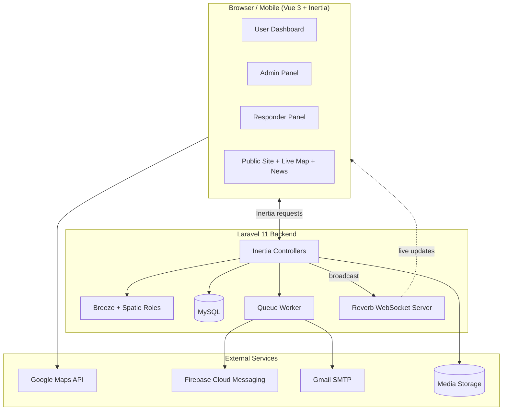
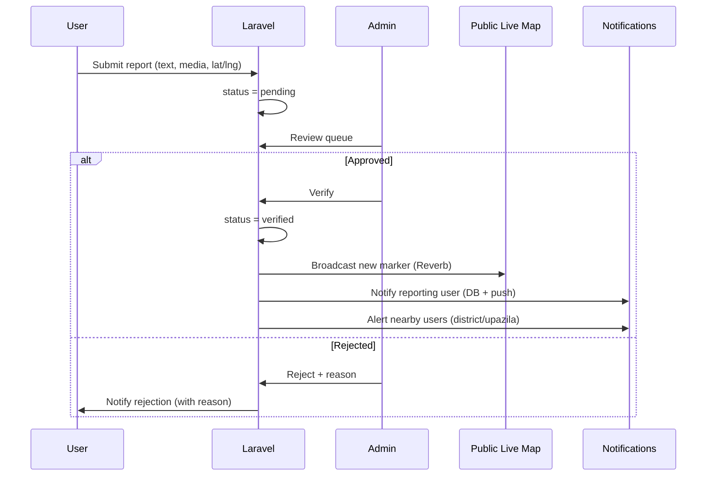
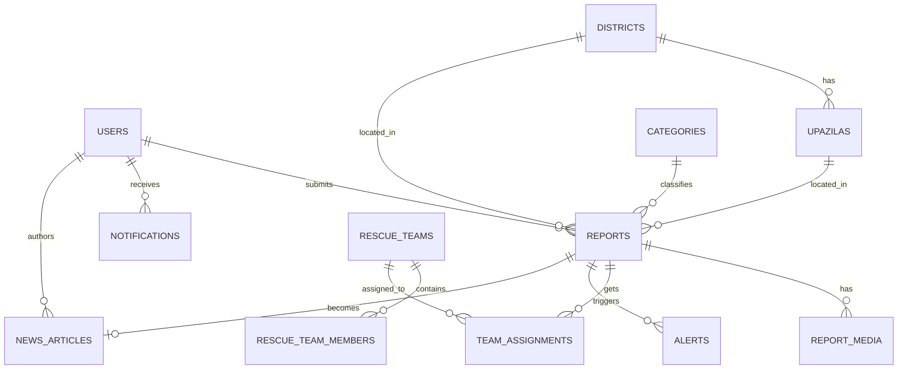
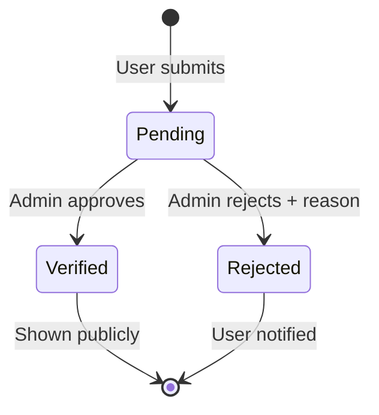
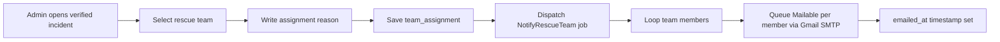
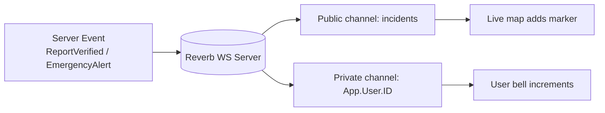
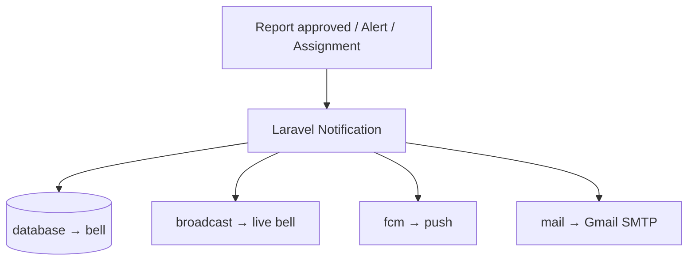

# Real-Time Disaster Monitoring & Reporting Platform — Full Build Plan

**Stack:** Laravel 11 + Inertia.js + Vue 3 · MySQL · Google Maps · Firebase Cloud Messaging · Gmail SMTP · Laravel Forge
**Team:** Nurnahar Nuri (210147) · Riazul Islam Mubin (210161) — DIIT, CSE

This is your single source of truth. Build top to bottom. Every feature you listed is mapped to concrete tables, routes, events, and jobs.

---

## 1. Locked Technical Decisions

These are the final choices. Stop debating tools and build.

| Concern | Decision | Why |
|---|---|---|
| Framework | **Laravel 11** | Latest LTS-style, slim structure |
| Frontend | **Inertia + Vue 3 (Composition API) + Vite** | SPA feel, no separate API layer to maintain |
| Styling | **Tailwind CSS** | Fast, matches your gamma design |
| Auth scaffold | **Laravel Breeze (Inertia-Vue stack)** | Lightweight login/register out of the box |
| Roles | **spatie/laravel-permission** | Clean admin / responder / user separation |
| Real-time | **Laravel Reverb + Laravel Echo** | First-party WebSockets, free, no Pusher bill |
| Push notifications | **FCM** via `laravel-notification-channels/fcm` | Browser + mobile push |
| Email | **Gmail SMTP** (App Password) | Your "SMS by Gmail" = transactional email |
| Maps | **Google Maps JS API** + marker clustering | Live map + location picker |
| Media | **Local/`public` disk** (dev) → **S3-compatible** (prod) + thumbnails | Image/video upload |
| Queue | **database** driver + Supervisor worker | Emails/push run in background |
| Hosting | **Laravel Forge** + Ubuntu VPS | One-click deploy, queue worker, SSL |

> **Note on "real-time":** users submit reports manually. "Real-time" in your project means: the **live map and the in-app notification bell update instantly** (via Reverb broadcasting) the moment an admin approves a report — no page refresh. That is the part Reverb solves.

---

## 2. System Architecture



**The golden flow (report lifecycle):**



---

## 3. User Roles & Permission Matrix

Three roles via `spatie/laravel-permission`.

| Capability | User | Responder | Admin |
|---|:---:|:---:|:---:|
| Register / login | ✅ | ✅ | ✅ |
| Submit report + media + location | ✅ | ✅ | ✅ |
| See own reports & their status | ✅ | ✅ | ✅ |
| Receive approval/rejection notification | ✅ | ✅ | ✅ |
| View public live map & news | ✅ | ✅ | ✅ |
| Verify / reject reports | ❌ | ❌ | ✅ |
| Send emergency alerts | ❌ | ❌ | ✅ |
| Create rescue teams & members | ❌ | ❌ | ✅ |
| Assign team to incident + reason | ❌ | ❌ | ✅ |
| Email assigned team members | ❌ | ❌ | ✅ |
| Update assignment progress | ❌ | ✅ (own) | ✅ |
| Publish news articles | ❌ | ❌ | ✅ |
| Manage users / districts | ❌ | ❌ | ✅ |

---

## 4. Database Design

### 4.1 Entity Relationship Overview



### 4.2 Tables (migration blueprint)

**users** (extend Breeze default)
```
id, name, email (unique), password,
phone (nullable), avatar (nullable),
district_id (FK, nullable), upazila_id (FK, nullable),
fcm_token (nullable, text),        // for push
last_lat, last_lng (nullable),     // optional, for "nearby" alerts
status (enum: active/blocked, default active),
timestamps
```
Roles handled by spatie pivot tables (`roles`, `model_has_roles`).

**districts**
```
id, name, name_bn, lat, lng, timestamps
```

**upazilas**
```
id, district_id (FK), name, name_bn, lat, lng, timestamps
```

**categories** (disaster types: Flood, Fire, Road Accident, Cyclone, Building Collapse, Other)
```
id, name, slug (unique), icon, color (hex for map markers), timestamps
```

**reports**  ← the core table
```
id,
user_id (FK),
category_id (FK),
title,
description (text),
district_id (FK), upazila_id (FK, nullable),
address (nullable),
latitude (decimal 10,7), longitude (decimal 10,7),   // shared by user
severity (enum: low/medium/high/critical, default medium),
status (enum: pending/verified/rejected, default pending),  // index this
verified_by (FK users, nullable),
verified_at (nullable),
rejection_reason (text, nullable),
occurred_at (nullable),
timestamps
```

**report_media**
```
id, report_id (FK),
type (enum: image/video),
disk, path,
thumbnail_path (nullable),
mime, size,
timestamps
```

**rescue_teams**
```
id, name, leader_name, leader_phone, leader_email,
district_id (FK, nullable),
status (enum: available/busy/offline, default available),
timestamps
```

**rescue_team_members**
```
id, rescue_team_id (FK),
name, email, phone,
role_in_team (nullable),   // e.g. Diver, Driver, Medic
timestamps
```

**team_assignments**
```
id,
report_id (FK),
rescue_team_id (FK),
assigned_by (FK users),
reason (text),                                  // admin's reason
status (enum: assigned/en_route/on_site/completed/cancelled, default assigned),
emailed_at (nullable),                          // when team emails went out
timestamps
```

**alerts**
```
id, report_id (FK, nullable),
title, message (text),
district_id (FK, nullable), upazila_id (FK, nullable),
radius_km (nullable),       // optional geo radius
sent_by (FK users),
sent_at,
timestamps
```

**news_articles**
```
id,
report_id (FK, nullable),    // can be born from a verified report
author_id (FK users),
title, slug (unique), excerpt, body (longtext),
cover_image (nullable),
category_id (FK, nullable),
district_id (FK, nullable),
status (enum: draft/published, default draft),
views (default 0),
published_at (nullable),
timestamps
```

**notifications** — Laravel's default polymorphic table (`php artisan notifications:table`).

---

## 5. Feature-by-Feature Implementation Plan

Each of your 9 features, mapped to real code paths.

### Feature 1 — Real-Time Disaster Reporting *(manual → approve → frontend)*

**Flow you described:** user submits from dashboard → admin approves → it appears on the public frontend/map.

- **Submit:** `ReportController@store`. Validates text + category + lat/lng + media. Sets `status = pending`. Saves to `reports` + `report_media`.
- **Admin queue:** `Admin/ReportController@index` lists `status = pending`, newest first.
- **Approve:** `Admin/ReportController@verify` → sets `status = verified`, `verified_by`, `verified_at` → fires `ReportVerified` event.
- **Public site:** the public live map and news only query `where status = verified`. So nothing shows publicly until approved. ✅ exactly your requirement.
- **Reject:** `Admin/ReportController@reject` → `status = rejected` + `rejection_reason`, notifies user.

```php
// app/Http/Controllers/ReportController.php
public function store(StoreReportRequest $request)
{
    $report = $request->user()->reports()->create([
        ...$request->validated(),
        'status' => 'pending',
    ]);
    $this->mediaService->attach($report, $request->file('media', []));
    return back()->with('success', 'Report submitted. Awaiting admin verification.');
}
```

### Feature 2 — Live Map with Incident Markers *(location shared by user)*

- **Report form has a map picker** (Google Maps): user drops a pin or uses "use my location" → fills `latitude` / `longitude`. Store those exact coordinates.
- **Public live map** loads verified incidents as JSON, renders colored markers by `category.color`, uses **marker clustering** so dense areas stay readable.
- **Reverb live update:** when a report is verified, broadcast a `ReportVerified` event on a public `incidents` channel. The map's Vue component listens and pushes the new marker in without refresh.

```js
// resources/js/composables/useLiveMap.js
Echo.channel('incidents')
  .listen('ReportVerified', (e) => addMarkerToMap(e.incident));
```

### Feature 3 — Image / Video Upload

- Accept **multiple images + one short video** per report.
- Validation: images `jpg,png,webp` ≤ 5 MB; video `mp4` ≤ 30 MB, short clip.
- Generate **thumbnails** for images (Intervention Image) and store a poster frame reference for video.
- Store on `public` disk in dev, S3 in prod. Save metadata in `report_media`.

```php
'media'   => 'array|max:6',
'media.*' => 'file|mimes:jpg,jpeg,png,webp,mp4|max:30720',
```

### Feature 4 — Admin Verification Workflow



- Dedicated **review screen**: media gallery, map preview, reporter info, category, severity.
- One click **Approve** or **Reject (with required reason)**.
- Every action logged (`verified_by`, `verified_at`, `rejection_reason`).

### Feature 5 — Emergency Alert / Notification System *(user gets approval notice in panel)*

Three delivery channels driven by Laravel Notifications:

| Channel | Used for | Tech |
|---|---|---|
| **database** | Bell icon in user panel | Laravel `database` channel |
| **broadcast** | Real-time bell update (no refresh) | Reverb |
| **fcm** | Browser/mobile push | FCM channel |

**Your exact requirement:** "if user is logged in, the approval notification comes to the user panel."

```php
// app/Notifications/ReportApproved.php
public function via($notifiable) { return ['database', 'broadcast', 'fcm']; }
```

On approve → `$report->user->notify(new ReportApproved($report));`
The Vue bell listens on the private user channel and increments live.

**Area alerts:** when a high-severity incident is verified, admin (or auto-rule) sends an `EmergencyAlert` to all users in the same `district_id` / `upazila_id` (push + database). Optional haversine radius for "nearby users."

### Feature 6 — Disaster News / Newspaper Module

- Admin can **convert a verified report into a news article** (one button → pre-fills title/body/cover from the report), or write standalone articles.
- `news_articles` with `status = draft/published`, slug, cover, category, district.
- Public **newspaper-style listing** + single article page, filterable by district/category. View counter increments per visit.

### Feature 7 — Role-Based Access Control

- `spatie/laravel-permission`. Seed roles `admin`, `responder`, `user`.
- Middleware on route groups: `->middleware('role:admin')`, etc.
- Vue side: pass `auth.user.roles` via Inertia shared props; conditionally render menu items. **Never trust the frontend** — always enforce on the server too.

### Feature 8 — Location-Based Filtering (District / Upazila)

- Seed all **64 districts + upazilas** (`districts`, `upazilas` tables).
- Cascading dropdowns: pick district → upazila list loads.
- Filters apply to: live map, report list, news, and alerts targeting.
- Index `district_id`, `upazila_id`, `status` for fast queries.

### Feature 9 — Rescue Team Assignment *(your team-by-team email flow)*

**Your exact requirement:** Admin assigns a rescue team to an incident, writes a reason, then sends an email — *team by team*, so **every member of the assigned team** gets the message via Gmail.



- `Admin/AssignmentController@store` creates a `team_assignment` (report + team + reason).
- Dispatches a **queued job** that loops the team's members and queues one `RescueAssignmentMail` per member → each member receives the full assignment (incident location, map link, reason, severity, reporter contact).
- Runs on the queue worker so the admin isn't blocked while 5–10 emails send.

```php
// app/Jobs/NotifyRescueTeam.php
public function handle()
{
    foreach ($this->assignment->team->members as $member) {
        Mail::to($member->email)->queue(
            new RescueAssignmentMail($this->assignment, $member)
        );
    }
    $this->assignment->update(['emailed_at' => now()]);
}
```

---

## 6. Real-Time Architecture (Reverb)



Channels:
- `incidents` (public) → new verified markers for the map.
- `App.Models.User.{id}` (private) → personal notifications.
- `admin-reports` (private, admin-only) → new pending report badge for admins.

Setup: `php artisan install:broadcasting` → installs Reverb + Echo. Configure `BROADCAST_CONNECTION=reverb`. Run `php artisan reverb:start` (Supervisor in prod).

---

## 7. Notification System (3 channels, one place)



`.env` for Gmail (use an **App Password**, not your real password):
```
MAIL_MAILER=smtp
MAIL_HOST=smtp.gmail.com
MAIL_PORT=587
MAIL_USERNAME=youraddress@gmail.com
MAIL_PASSWORD=your_16_char_app_password
MAIL_ENCRYPTION=tls
MAIL_FROM_ADDRESS=youraddress@gmail.com
MAIL_FROM_NAME="Disaster Platform"
QUEUE_CONNECTION=database
```

---

## 8. Project / Folder Structure

```
app/
  Http/
    Controllers/
      ReportController.php
      LiveMapController.php
      NewsController.php
      Admin/
        ReportController.php          # verify / reject
        AlertController.php
        RescueTeamController.php
        AssignmentController.php
        NewsController.php
    Requests/
      StoreReportRequest.php
      AssignTeamRequest.php
    Middleware/
  Events/
    ReportVerified.php
    EmergencyAlertBroadcast.php
  Jobs/
    NotifyRescueTeam.php
    GenerateThumbnails.php
  Mail/
    RescueAssignmentMail.php
  Notifications/
    ReportApproved.php
    ReportRejected.php
    EmergencyAlert.php
  Models/
    User.php Report.php ReportMedia.php Category.php
    District.php Upazila.php RescueTeam.php RescueTeamMember.php
    TeamAssignment.php Alert.php NewsArticle.php
  Services/
    MediaService.php
    AlertService.php
resources/js/
  Pages/
    Public/ (Home, Map, NewsIndex, NewsShow)
    User/   (Dashboard, ReportCreate, MyReports, Notifications)
    Admin/  (Dashboard, ReportReview, Teams, Assignments, News, Alerts)
    Responder/ (Dashboard, MyAssignments)
  Components/
    Map/IncidentMap.vue
    Map/LocationPicker.vue
    Report/MediaUploader.vue
    NotificationBell.vue
  composables/
    useLiveMap.js
    useNotifications.js
database/
  migrations/ seeders/ (DistrictSeeder, UpazilaSeeder, CategorySeeder, RoleSeeder)
```

---

## 9. Route Map (high level)

```
# Public
GET  /                         Home
GET  /map                      Live incident map (verified only)
GET  /map/incidents.json       Map data feed
GET  /news                     News list
GET  /news/{slug}              News article

# Auth (Breeze)
/login /register /logout

# User (auth)
GET  /dashboard                User dashboard
GET  /reports/create           Report form (with map picker)
POST /reports                  Submit report
GET  /my-reports               Own reports + status
GET  /notifications            Notification center

# Admin (auth + role:admin)
GET  /admin                    Admin dashboard
GET  /admin/reports            Pending queue
POST /admin/reports/{id}/verify
POST /admin/reports/{id}/reject
GET  /admin/teams              Rescue teams CRUD
POST /admin/reports/{id}/assign      Assign team + reason + email
POST /admin/alerts             Send area alert
GET  /admin/news               News management
POST /admin/news               Publish article

# Responder (auth + role:responder)
GET  /responder/assignments
POST /responder/assignments/{id}/status
```

---

## 10. Security & Validation Checklist

- Form Request validation on every write (`StoreReportRequest`, `AssignTeamRequest`).
- Authorization via **Policies** + role middleware (server-side, always).
- File uploads: strict mime + size limits, store outside web root logic, never trust client filename.
- Rate-limit report submission (`throttle:10,1`) to prevent spam/fake floods.
- CSRF (built into Inertia), XSS-safe Blade/Vue rendering, parameterized queries (Eloquent).
- Hide rejected/pending reports from all public endpoints.
- Gmail App Password in `.env` only, never committed.

---

## 11. Development Phases (aligned to your Gantt)

### Phase 1 — Foundation *(April: Requirement Analysis, System Design, DB Design)*
- [ ] Finalize requirements & this plan
- [ ] Install Laravel 11 + Breeze (Inertia-Vue) + Tailwind
- [ ] Install spatie/laravel-permission, seed roles
- [ ] Write all migrations + models + relationships
- [ ] Seed districts, upazilas, categories
- [ ] Auth working (register/login, role redirect)

### Phase 2 — Core Build *(May: Backend + Frontend Development)*
- [ ] Report submission (text + category + severity)
- [ ] User dashboard + "My Reports" with status badges
- [ ] Admin review queue (list pending)
- [ ] Verify / reject workflow + reason
- [ ] Role-based navigation & guards
- [ ] Public home + news scaffolding

### Phase 3 — Integrations *(June: Maps, Media, Verification, Alerts)*
- [ ] Google Maps location picker in report form
- [ ] Public live map with clustered markers
- [ ] Image/video upload + thumbnails
- [ ] Laravel Reverb real-time map + bell
- [ ] Notification system (database + broadcast + FCM)
- [ ] Emergency area alerts (district/upazila)
- [ ] Rescue team CRUD + assignment + **team-by-team Gmail emails**

### Phase 4 — Finish *(July: News, Testing, Deployment)*
- [ ] News/newspaper module (convert report → article, publish)
- [ ] Location-based filtering across map/news/reports
- [ ] Responder panel (view & update assignments)
- [ ] Full testing pass (see §12)
- [ ] Deploy on Forge + queue worker + Reverb + SSL

---

## 12. Testing Strategy

| Layer | What to test |
|---|---|
| Unit | Report status transitions, haversine/area-alert targeting |
| Feature | Submit report, admin verify → public visibility, reject → user notified |
| Auth | Each role can only reach allowed routes |
| Notifications | `Notification::fake()` asserts ReportApproved sent on verify |
| Mail/Jobs | `Mail::fake()` + `Queue::fake()` assert one mail per team member |
| Manual | Map markers appear live after approval; bell updates without refresh; uploads render |

---

## 13. Deployment Plan (Forge)

1. Provision Ubuntu VPS via Forge; create site, point domain.
2. Connect GitHub repo; set deploy script (`composer install`, `npm run build`, `php artisan migrate --force`, `php artisan optimize`).
3. `.env`: DB, Gmail SMTP, Google Maps key, FCM key, `BROADCAST_CONNECTION=reverb`.
4. **Forge Daemon**: `php artisan queue:work --tries=3` (email/push jobs).
5. **Forge Daemon**: `php artisan reverb:start` (WebSockets) + open its port / proxy.
6. Enable free Let's Encrypt SSL.
7. Schedule `php artisan schedule:run` (cleanup, digest jobs).

---

## 14. Risks & Mitigation

| Risk | Mitigation |
|---|---|
| Fake/spam reports | Admin verification gate + rate limiting (future: AI detection) |
| Large video uploads slow server | Size cap (30 MB), background thumbnail job, move to S3 in prod |
| Gmail daily send limit (~500/day) | Fine for a college project; note upgrade path to a mail service |
| Reverb config complexity | Use `install:broadcasting`; fall back to short polling if needed |
| Map API quota/billing | Restrict API key by domain; cache map data feed |

---

## 15. Future Enhancements (from your slides — keep as roadmap)

AI-based fake report detection · Bangla voice reporting (speech-to-text) · Offline reporting with sync · Weather API integration · Satellite data layer · Volunteer & donation management.

---

### Build order TL;DR
**Auth + roles → DB + seeders → report submit → admin verify → public map → media → Reverb live updates → notifications (panel + push + mail) → rescue team email flow → news module → filters → test → deploy.**

Follow the phases, check the boxes, and you ship a complete, defensible final-year project.
